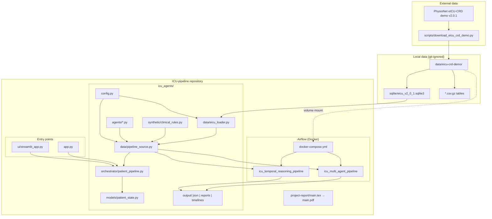
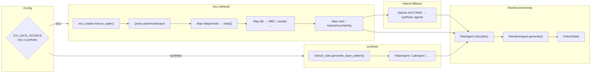
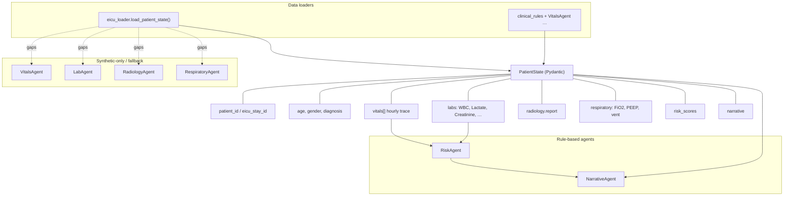
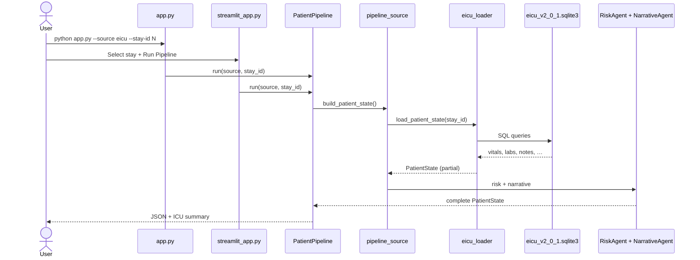
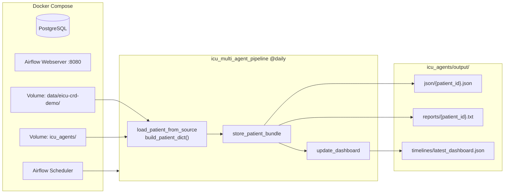
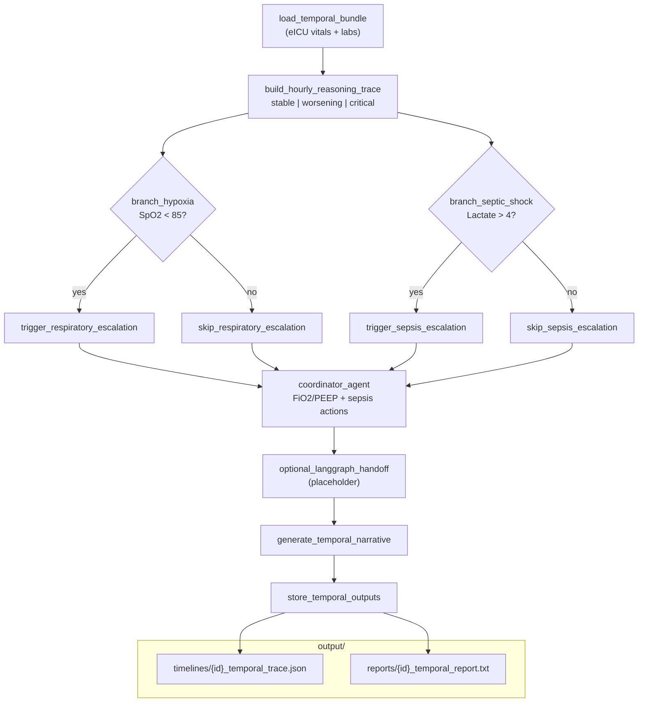
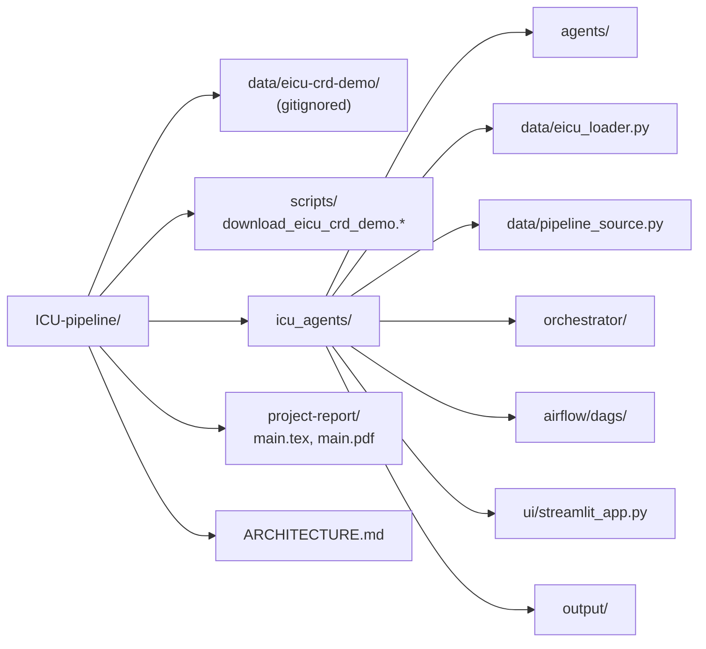

# ICU Pipeline — System Architecture

> Setup and commands: [README.md](README.md)

Mermaid diagrams for the current **ICU-pipeline** setup: PhysioNet [eICU-CRD demo v2.0.1](https://physionet.org/content/eicu-crd-demo/2.0.1/), `icu_agents` multi-agent stack, and Apache Airflow orchestration.

---

## 1. High-level overview



---

## 2. Data source modes (`ICU_DATA_SOURCE`)



---

## 3. Agent layer and `PatientState`



---

## 4. Local execution paths



---

## 5. Airflow: `icu_multi_agent_pipeline`



---

## 6. Airflow: `icu_temporal_reasoning_pipeline`



---

## 7. Repository layout



---

## 8. Environment variables

| Variable | Default | Purpose |
|----------|---------|---------|
| `ICU_DATA_SOURCE` | `eicu` | `eicu` or `synthetic` |
| `EICU_DEMO_DIR` | `data/eicu-crd-demo` | Path to PhysioNet demo files |
| `OPENAI_MODEL` | `gpt-4o-mini` | Reserved for future LLM narrative |

---

## Quick commands

```bash
# Download dataset (background)
bash scripts/download_eicu_crd_demo.sh

# Local pipeline (eICU stay)
cd icu_agents && python app.py --source eicu --stay-id 147784

# Streamlit UI
cd icu_agents && streamlit run ui/streamlit_app.py

# Airflow
cd icu_agents && docker compose up -d
# UI: http://localhost:8080
```
