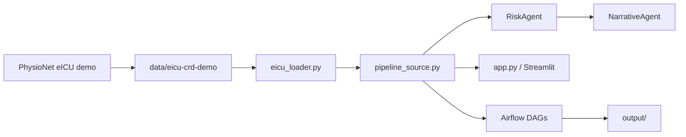

# ICU Pipeline

**Generative clinical narrative and risk explanation from ICU time-series data** — M.Tech project integrating the [eICU Collaborative Research Database demo](https://physionet.org/content/eicu-crd-demo/2.0.1/) with a multi-agent Python stack and Apache Airflow workflows.

> **Architecture diagrams:** see **[ARCHITECTURE.md](ARCHITECTURE.md)** for Mermaid flowcharts (data flow, agents, Airflow DAGs, repo layout).


---

## Features

- Load real ICU stays from PhysioNet **eICU-CRD demo** (`patientunitstayid`, vitals, labs, notes, ventilation)
- Multi-agent pipeline: **RiskAgent**, **NarrativeAgent**, with synthetic fallbacks when charting is sparse
- **Temporal reasoning** in Airflow: hourly severity traces, hypoxia/sepsis branching, coordinator escalation
- CLI, Streamlit UI, and scheduled DAGs with JSON/report artifacts
- Dissertation report in `project-report/main.pdf`

---

## Repository layout

| Path | Description |
|------|-------------|
| [`icu_agents/`](icu_agents/) | Agents, orchestrator, Airflow DAGs, Streamlit UI |
| [`data/eicu-crd-demo/`](data/eicu-crd-demo/) | Local eICU demo dataset (git-ignored) |
| [`scripts/`](scripts/) | Dataset download scripts |
| [`project-report/`](project-report/) | LaTeX dissertation source and PDF |
| [**`ARCHITECTURE.md`**](ARCHITECTURE.md) | **System architecture (Mermaid diagrams)** |

---

## Quick start

### 1. Clone and download data

```bash
# Background download (~130 MB)
bash scripts/download_eicu_crd_demo.sh

# Or foreground
python scripts/download_eicu_crd_demo.py
```

Data lands in `data/eicu-crd-demo/` (SQLite + CSV.gz). The loader auto-decompresses `sqlite/eicu_v2_0_1.sqlite3.gz` on first use.

### 2. Install `icu_agents`

```bash
# Use the existing venv at repo root (do not create a second one under icu_agents/)
cd ICU-pipeline
source venv/Scripts/activate    # Windows Git Bash
# source venv/bin/activate      # Linux / macOS / WSL
pip install -r icu_agents/requirements.txt
```

### 3. Run pipeline (eICU stay)

```bash
cd icu_agents
python app.py --source eicu --stay-id 147784
```

### 4. Streamlit UI

```bash
streamlit run ui/streamlit_app.py
```

Select **eicu** or **synthetic** and pick a `patientunitstayid` from the sidebar.

### 5. Airflow (Docker)

```bash
cd icu_agents
docker compose up airflow-init
docker compose up -d airflow-webserver airflow-scheduler
```

Open [http://localhost:8080](http://localhost:8080) (login: `admin` / `admin`). Trigger:

- `icu_multi_agent_pipeline`
- `icu_temporal_reasoning_pipeline`

Outputs: `icu_agents/output/json`, `reports`, `timelines`.

See [icu_agents/README.md](icu_agents/README.md) for WSL2 setup and troubleshooting.

---

## Configuration

| Variable | Default | Description |
|----------|---------|-------------|
| `ICU_DATA_SOURCE` | `eicu` | `eicu` or `synthetic` |
| `EICU_DEMO_DIR` | `data/eicu-crd-demo` | Path to PhysioNet demo files |

Set in the shell or in `icu_agents/docker-compose.yml` for Airflow containers.

---

## Architecture (summary)



Full diagrams (8 sections): **[ARCHITECTURE.md](ARCHITECTURE.md)**

---

## Citation

When using the eICU-CRD demo, cite PhysioNet:

> Johnson, A., Pollard, T., Badawi, O., & Raffa, J. (2021). eICU Collaborative Research Database Demo (version 2.0.1). *PhysioNet*. https://doi.org/10.13026/4mxk-na84

---

## License & disclaimer

Research prototype only — **not for clinical use**. eICU-CRD demo is subject to the [PhysioNet license](https://physionet.org/content/eicu-crd-demo/2.0.1/).
