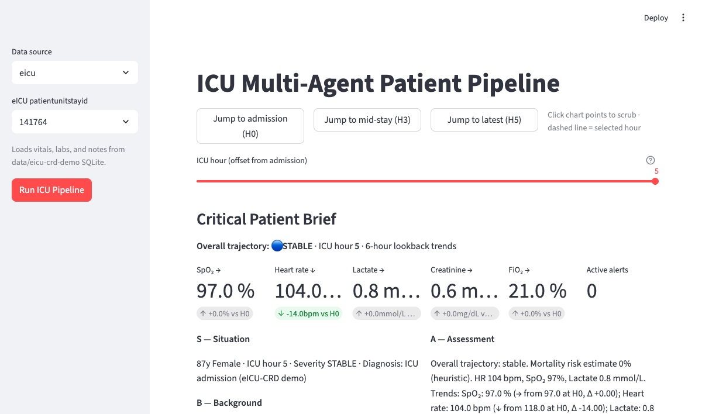
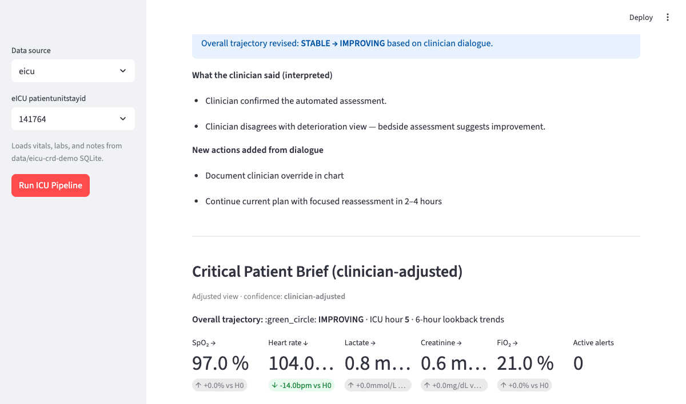
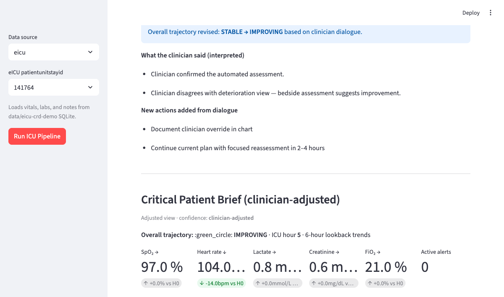

<!-- _class: lead -->

# Generative Clinical Narrative and Risk Explanation from ICU Time-Series Data Using Large Language Models

**Surya Pratap Singh Shekhawat** · PES2PGE24DS117  
M.Tech — Data Science & Artificial Intelligence  
**Guide:** Prof. Mahesh RAMEGOWDA · PES University  
January – May 2026

<!--
SPEAKER NOTE (30 sec)
Introduce yourself. One-liner: "End-to-end clinical ML pipeline that turns ICU time-series into grounded narratives and decision-support briefs."
-->

---

## The Problem

**ICU clinicians face a data overload problem**

- High-frequency vitals, irregular labs, ventilation settings, clinical notes — stored in relational tables
- Risk scores give a number but not **why** or **what to do next**
- Raw tables are hard to scan under time pressure at the bedside

> **Gap:** Transform structured ICU time-series into **interpretable, point-in-time** natural-language explanations — without leaking future data.

<!--
SPEAKER NOTE (90 sec)
Emphasize temporal leakage — summarizing a full stay at hour 5 using hour 10 labs is clinically wrong AND an ML serving bug.
-->

---

## Objectives

| # | Objective |
|---|-----------|
| 1 | Load real ICU stays from **eICU-CRD demo** (PhysioNet) |
| 2 | Build a **multi-agent pipeline** for vitals, labs, risk, and narrative |
| 3 | Enforce **point-in-time snapshots** — all views reflect data known only up to selected ICU hour |
| 4 | Deliver **Critical Patient Brief** — SBAR, 6hr trends, explainable alerts, actions |
| 5 | Support **clinician dialogue + feedback overlay** (human-in-the-loop) |
| 6 | Orchestrate batch runs via **Apache Airflow** with persisted artifacts |

**Scope:** Research prototype — not validated for clinical deployment

---

## Dataset & Data Pipeline

**eICU Collaborative Research Database — Demo v2.0.1**

- 2,500+ de-identified ICU stays · 20 hospitals · open PhysioNet access
- Local store: `data/eicu-crd-demo/` (SQLite + CSV.gz)
- Loader: `eicu_loader.py` → unified **`PatientState`** schema (Pydantic)

**Dual mode**
- `ICU_DATA_SOURCE=eicu` — real measurements (primary)
- `ICU_DATA_SOURCE=synthetic` — fallback when charting is sparse

**Mapped modalities:** vitals · labs · notes · respiratory charting · diagnosis

---

## System Architecture


**Five layers:** Data → Agents → Orchestration → Clinical DSS → Serving (CLI + Streamlit + Airflow)

<!--
Optional: swap image to system_architecture.png for a diagram-first slide.
-->

---

<!-- _class: small -->

## Core Contribution — Point-in-Time Snapshots

**Problem:** Future-data leakage invalidates bedside decision support

```
eICU SQLite  →  build_timeline()  →  snapshot_at_hour(h)  →  all downstream inference
```

| Function | Role |
|----------|------|
| `build_timeline()` | Merge hourly vitals, lab draws, notes, resp events |
| `snapshot_at_hour(h)` | Cumulative state using only events where `hour ≤ h` |
| `patient_view_at_hour()` | Immutable `PatientState` view for agents & UI |

> In ML terms: this is the **serving-time feature view** with `as_of` timestamp semantics.

**Every tab, chart, narrative, and brief recomputes from the snapshot — not the full stay.**

---

## Inference Stack — Rules + Optional LLM

| Component | Method | Rationale |
|-----------|--------|-----------|
| `RiskAgent` | Weighted thresholds (SpO₂, HR, lactate, creatinine) | Auditable, monotonic |
| `NarrativeAgent` | Template slot-filling from `PatientState` | Zero hallucination on numbers |
| `critical_brief.py` | SBAR + 6hr deltas + alert engine | Explainable evidence |
| `ClinicalChatAgent` | OpenAI (optional) + rule fallback | Conversational enrichment only |
| `feedback_overlay.py` | Keyword intent on clinician text | Deterministic HITL correction |

**Design choice:** Safety-critical outputs are **grounded and deterministic**; LLM only enriches dialogue when `OPENAI_API_KEY` is set.

---

## Airflow — Batch Temporal Reasoning

**DAG: `icu_temporal_reasoning_pipeline`**

1. Load eICU vitals/labs bundle
2. `build_hourly_reasoning_trace` → `stable` / `worsening` / `critical` per hour
3. Parallel branches: **hypoxia** (SpO₂ < 85) · **sepsis** (lactate > 4)
4. `coordinator_agent` → FiO₂/PEEP adjustments, sepsis action list
5. Persist `reasoning_trace`, `temporal_narrative` → `output/timelines/`

**DAG: `icu_multi_agent_pipeline`** — load stay → risk → narrative → JSON + dashboard metadata

Streamlit = interactive single-stay inference · Airflow = scheduled, reproducible batch artifacts

---

## Critical Patient Brief



**Automated decision-support panel at selected ICU hour**

- Overall trajectory: STABLE / IMPROVING / DETERIORATING
- **Six-hour trend deltas** — SpO₂, HR, lactate, creatinine, FiO₂
- **Explainable alerts** with hour-stamped evidence (hypoxemia, tachycardia, AKI)
- SBAR sections + prioritized recommended actions + data-gap warnings

---

## Streamlit Dashboard — Demo Walkthrough

 

**Temporal navigation:** hour slider · jump buttons · click-to-scrub on Plotly charts

| Tab | Purpose |
|-----|---------|
| Overview | Consolidated bedside snapshot |
| Vitals | Multi-axis time-series through selected hour |
| Labs & Risk | Lab panel, mortality/sepsis/deterioration scores |
| Clinical Narrative | Point-in-time `NarrativeAgent` report |
| Doctor Dialogue | `ClinicalChatAgent` with quick prompts |

**Demo stay:** `patientunitstayid` **141764** · ICU hour **5**

---

## Human-in-the-Loop — Feedback Overlay


**Clinician:** *"I disagree — the patient may be improving"*

| Before | After |
|--------|-------|
| Trajectory: STABLE | Trajectory: **IMPROVING** |
| Automated alerts active | Matched alerts **suppressed** |
| Rule-based actions | **Clinician-directed** actions added |

**Key boundary:** Vitals and labs are **unchanged** — only the interpretation layer is adjusted. Automated baseline preserved for audit comparison.

---

## Evaluation & Limitations

**Evaluated (systems correctness)**
- Pydantic schema validity · eICU mapping fidelity
- Risk monotonicity (higher lactate / lower SpO₂ → higher score)
- Point-in-time integrity · temporal severity alignment
- Feedback overlay correctness · UI hour-scrub synchronization

**Limitations (v1)**
- Risk not calibrated to SOFA/APACHE · template narratives
- Sparse vitals in some demo stays · no clinician inter-rater study
- Dialogue audit logs not persisted · research prototype only

---

<!-- _class: lead -->

## Conclusion & Future Work

**Delivered:** Grounded clinical ML pipeline — eICU ingestion, temporal snapshots, interpretable risk & briefs, optional LLM dialogue, HITL feedback overlay, Airflow orchestration

**Future:** SOFA/APACHE calibration · feedback audit store · learned severity models · LLM faithfulness eval · meds/treatment timeline · FHIR export · BeeAI deployment

**Repository:** [github.com/suryashekhawat/MTech4SEM](https://github.com/suryashekhawat/MTech4SEM)

# Thank you

**Questions?** · Live demo available at `streamlit run ui/streamlit_app.py`

<!--
SPEAKER NOTE (30 sec)
Offer live demo or deep-dive into snapshot engine / feedback overlay.
-->
